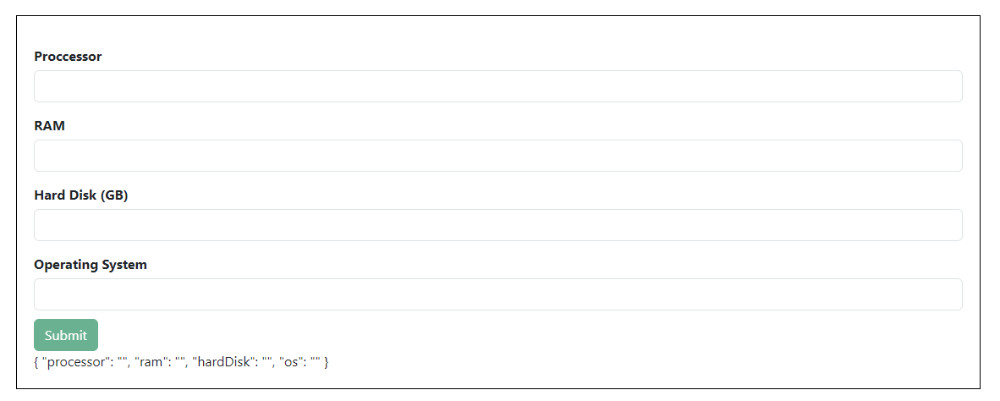
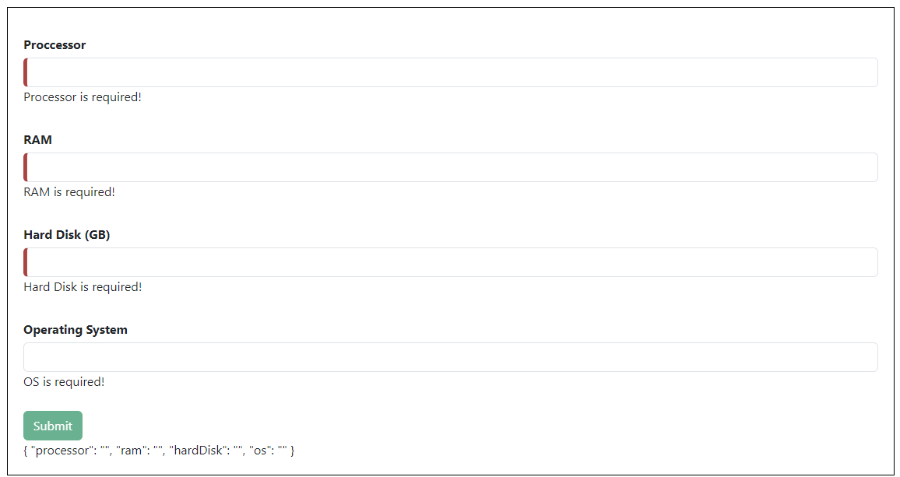

# form

### View

To install the Angular CLI, open a terminal window and run the following command:

    npm install -g @angular/cli

The **ng new {name}** command prompts you for information about features to include in the initial app. Accept the defaults by pressing the Enter or Return key.

The **ng serve** command launches the server, watches your files, and rebuilds the app as you make changes to those files.

The **--open** (or just -o) option automatically opens your browser to http://localhost:4200/.

To connect the angular app with firebase
1.
    ​firebase login --reauth
2.
    ​npm i -D firebase-tools
3.
    ng add @angular/fire

To work directly with the Firebase's db